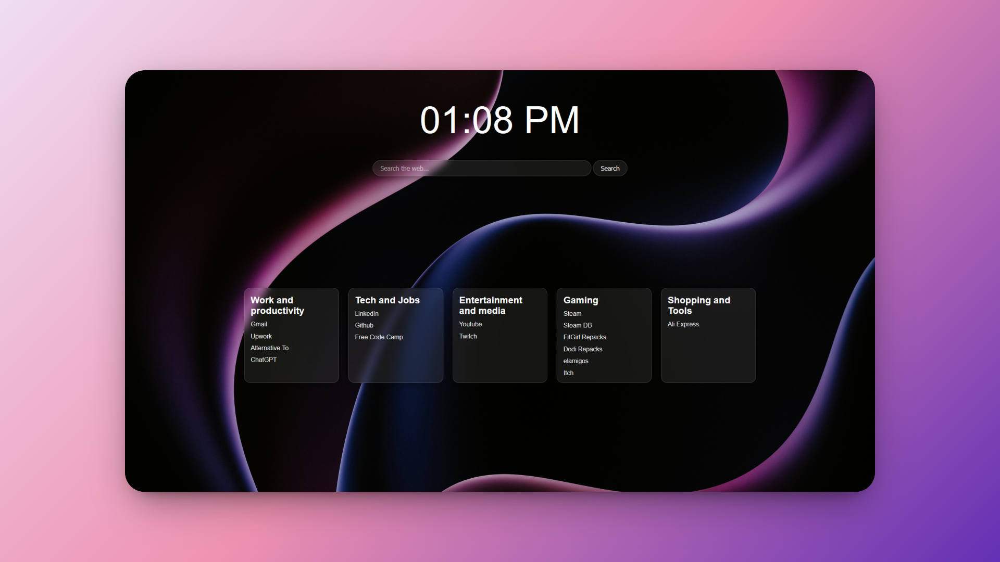

# 🚀 Beautiful and Minimal Start Page

A sleek, personalized browser start page featuring a dynamic clock, a DuckDuckGo search bar, and easily accessible links to my most-visited websites, all within a beautiful frosted glass aesthetic.

---

## ✨ Features

- **Real-time Clock:** Displays the current time with AM/PM (and optional date).
- **Integrated Search:** Quickly search the web using DuckDuckGo directly from your start page.
- **Organized Links:** Categorized sections for quick access to your favorite sites (Work & Productivity, Tech & Learning, Entertainment, Gaming, Shopping & Tools).
- **Beautiful Design:** Modern frosted glass effect with a customizable background image, providing a clean and elegant interface.
- **Lightweight & Fast:** Built with pure HTML, CSS, and JavaScript for optimal performance.

---

## 📸 Screenshot



---

## 💻 How to Use

This project is designed to be your browser's custom start page. Here's how you can set it up:

### Prerequisites

- A web browser (Chrome, Firefox, Edge, etc.)

### Installation & Setup

1.  **Clone the repository:**

    ```bash
    git clone https://github.com/YourUsername/custom-start-page.git
    ```

    (Replace `YourUsername` with your actual GitHub username and `custom-start-page` with your repository name.)

2.  **Navigate to the project directory:**

    ```bash
    cd custom-start-page
    ```

3.  **Open in your browser:**
    Simply open the `index.html` file in your preferred web browser.

    ```bash
    # On most systems, this command will open the file in your default browser
    open index.html
    ```

### Setting as Your Browser's Start Page

- **Chrome/Edge:**
  1.  Go to **Settings** \> **On startup**.
  2.  Select "Open a specific page or set of pages".
  3.  Click "Add a new page" and enter the file path to your `index.html` (e.g., `file:///Users/YourUser/custom-start-page/index.html`).
- **Firefox:**
  1.  Go to **Settings** \> **Home**.
  2.  Under "Homepage and new windows", select "Custom URLs...".
  3.  Enter the file path to your `index.html`.

_(Instructions may vary slightly based on browser version.)_

---

## ⚙️ Customization

This start page is designed to be easily customizable to your needs.

### Background Image

- Change the `background-image` property in `styles.css` (around line 2) to your desired image URL or local path.
  ```css
  body {
    background-image: url("Images/your-new-bg.jpg"); /* Update this path */
    /* ... other styles */
  }
  ```

### Links

- Edit the `index.html` file to add, remove, or modify links within the `<section class="all_links">` block.

  - To add a new category, copy an existing `<div class="links">` block.
  - To add a new link, add an `<a>` tag with your desired `href` and text within a `<div class="links">`.

  <!-- end list -->

  ```html
  <div class="links">
    <h2>New Category</h2>
    <a href="https://example.com">Example Site</a>
  </div>
  ```

### Clock Display

- Adjust the `font-size` of the `#clock` in `styles.css` (around line 90) to change its size.
- Modify `clock.js` if you want to change the time format or add/remove seconds/date.

---

## 🤝 Contributing

Feel free to fork this repository, make your own improvements, and submit pull requests. Any suggestions or enhancements are welcome\!

---

## 📄 License

This project is open-source and available under the [MIT License](https://www.google.com/search?q=LICENSE).

---

## 📧 Contact

If you have any questions or feedback, feel free to reach out:

- **Your Name:** [Your GitHub Profile Link]
- **Email:** [Your Email Address]

---
